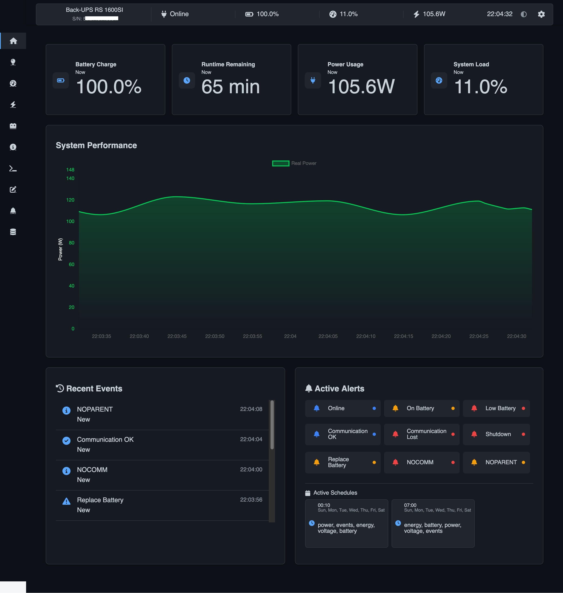
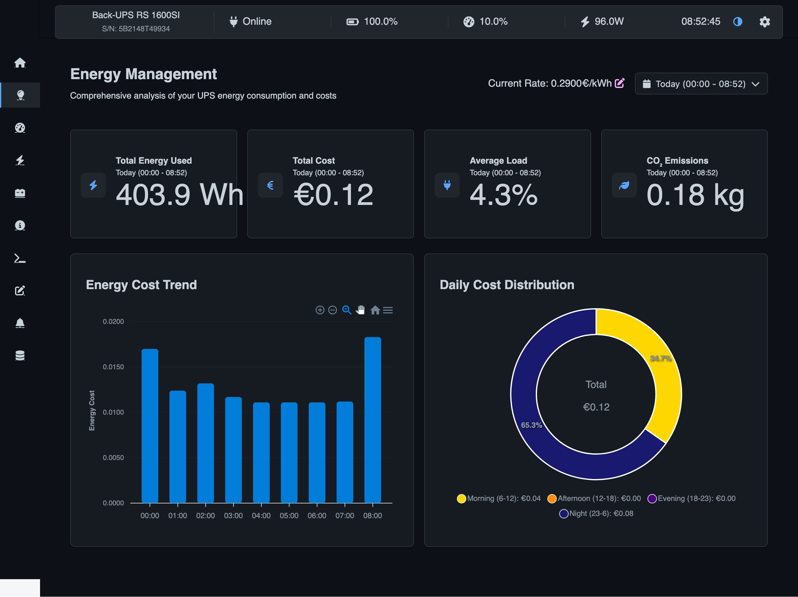

# Nutify - UPS Monitoring System


## Overview

Nutify is a comprehensive monitoring system designed to track the health and performance of your Uninterruptible Power Supply (UPS) devices. It provides real-time insights into critical UPS metrics, allowing you to ensure the continuous operation and protection of your valuable equipment. Nutify collects data, generates detailed reports, and visualizes key parameters through interactive charts, all accessible via a user-friendly web interface.



> **🆕 LATEST DOCKER IMAGES**  
> Use these tags to always get the latest version:  
> • AMD64/x86_64: `dartsteven/nutify:amd64-latest`  
> • ARM64/aarch64: `dartsteven/nutify:arm64-latest`  
> • ARMv7/armhf: `dartsteven/nutify:armv7-latest` (coming soon)

## Latest Version

**Current Version**: 0.1.2 (08/03/2025)

For a detailed list of changes and improvements, please see the [changelog.txt](changelog.txt) file.

## Key Features

* **Real-time UPS Monitoring:** Continuously collects and displays data from your UPS devices
* **Detailed Reports:** Generates comprehensive reports on UPS performance
* **Interactive Charts:** Visualizes UPS data using interactive charts
* **Customizable Dashboards:** Provides a web-based dashboard to view real-time data
* **Data Persistence:** Stores historical UPS data in a SQLite database
* **Dockerized Deployment:** Easily deployable using Docker and Docker Compose
* **Energy Monitoring:** Detailed analysis of energy consumption
* **Battery Management:** Monitoring of battery status and performance
* **Event Management:** Logging and notification of UPS events
* **UPS Commands:** Interface to send commands to the UPS
* **Dark/Light Theme:** Customizable interface with both dark and light themes
* **Email Reports:** Automated email reports with detailed UPS status

## Quick Start

To run Nutify using Docker Compose:

1. Create a `docker-compose.yaml` file with the following content:

```yaml
services:
  nut:
    image: dartsteven/nutify:amd64-latest
    container_name: Nutify-Server
    privileged: true
    cap_add:
      - SYS_ADMIN
      - SYS_RAWIO
      - MKNOD
    devices:
      - /dev/bus/usb:/dev/bus/usb:rwm
    device_cgroup_rules:
      - 'c 189:* rwm'
    environment:
      - SERVER_PORT=5050
      - ENCRYPTION_KEY=your-secret-key-here
      - UPS_NAME=ups
      - UPS_DRIVER=usbhid-ups
      - UPS_PORT=auto
      - SSL_ENABLED=false
    ports:
      - 3493:3493
      - 5050:5050
    volumes:
      - ./nut_data:/var/run/nut
      - ./nutify/logs:/app/nutify/logs
      - ./nutify/instance:/app/nutify/instance
      - ./ssl:/app/ssl
    restart: always
    user: root
```

2. Start Nutify:
   ```bash
   docker-compose up -d
   ```

3. Access Nutify:
   Open your web browser and navigate to `http://localhost:5050`

## Supported Architectures

Nutify is available for multiple hardware platforms:

| Architecture | Docker Image Tag | Devices |
|--------------|------------------|---------|
| 🖥️ **AMD64/x86_64** | `dartsteven/nutify:amd64-latest` | Standard PCs, servers, most cloud VMs |
| 🍓 **ARM64/aarch64** | `dartsteven/nutify:arm64-latest` | Raspberry Pi 4, Pi 400, Compute Module 4, Apple M1/M2 Macs |
| 🍓 **ARMv7/armhf** | `dartsteven/nutify:armv7-latest` | Raspberry Pi 2/3, older ARM-based devices (coming soon) |

You can also use specific version tags (e.g., `dartsteven/nutify:amd64-0.1.3`) if you need a particular version.

## Tested UPS Models

Currently, Nutify has been tested and confirmed working with the following UPS models:

- **Eaton 3S 550**
- **APC Back-UPS RS 1600SI**

While Nutify should work with any UPS device supported by Network UPS Tools (NUT), these specific models have been verified for compatibility and optimal performance.

## Documentation

For detailed documentation, including:
- Complete configuration options
- Advanced features
- Troubleshooting
- Screenshots and examples
- Technical details

Please refer to the [Nutify Wiki](https://github.com/DartSteven/Nutify/wiki).

## License

This project is licensed under the MIT License - see the LICENSE file for details.

## Screenshots

<div style="display: flex; justify-content: space-between;">
  <div style="flex: 1; margin-right: 10px;">
    <p><strong>Dark Theme</strong></p>
    
  </div>
  <div style="flex: 1; margin-left: 10px;">
    <p><strong>Light Theme</strong></p>
    
  </div>
</div>
